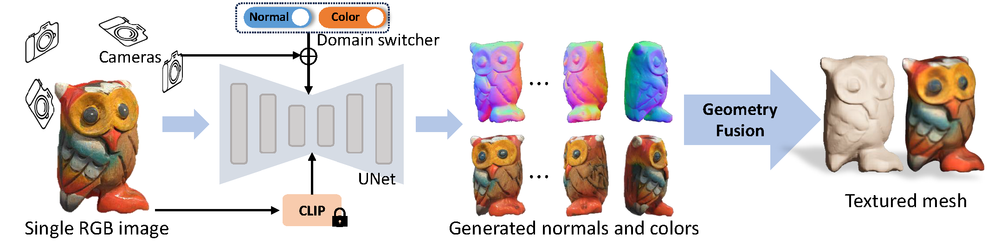

# Isotropic3D 

### **Contributions**

- We propose a novel image-to-3D pipeline called Isotropic3D that takes only
an image CLIP embedding as input. Isotropic3D aims to give full play to
2D diffusion model priors without requiring the target view to be utterly
consistent with the input view
- We introduce a view-conditioned multi-view diffusion model that integrates
Explicit Multi-view Attention (EMA), aimed at enhancing view generation
through fine-tuning. EMA combines noisy multi-view images with the noisefree reference image as an explicit condition. Such a design allows the reference image to be discarded from the whole network during the SDS-based
3D generation process
- Experiments demonstrate that with a single CLIP embedding, Isotropic3D
can generate promising 3D assets while still showing similarity to the reference image.
<!-- - We use HashGrid encoding and uniformly sample points along rays, while the paper uses Integrated Positional Encoding and sampling strategy from MipNeRF360.
- We adopt camera settings and density initialization strategy from Magic3D, which is slightly different from the DreamFusion paper.
- Some hyperparameters are different, such as the weighting of loss terms. -->

### **Method overview**

### **Comparison with other works**

### **Key Takeaways**
- Single CLIP embedding to entire 3D generation
- **Mulitview Diffusion** model what takes the reference image and the noisy rendered 2D images
-  A single loop to actually make the generation better

# GaussianObject 

## **Contributions**
- We propose to optimize 3D Gaussians from highly sparse views
with explicit structure priors, where several techniques are designed, including the visual hull for initialization and floater
elimination for training.
- A Gaussian repair model based on diffusion models is proposed
to remove artifacts caused by omitted or highly compressed
object information, where the rendering quality can be further
improved.
- The overall framework GaussianObject shows strong performance on several challenging real-world datasets, consistently
outperforming previous state-of-the-art methods for both qualitative and quantitative evaluation.

### **Method overview**

### **Comparison with other works**

### **Key Takeaways**
- Propose visual hull for coarse point cloud generation from 4 reference images
- Gaussian repair module and distance aware sampling
- 2D diffusion model and SDS loss to refine the initialized gaussians using gaussian rasterization for 2D rendering

# DreamGaussian 

## **Contributions**

### **Method overview**

### **Comparison with other works**

### **Key Takeaways**

# InstantMesh 

<video controls src="assets/322410754-dab3511e-e7c6-4c0b-bab7-15772045c47d-1.mp4" title="Title"></video>

## **Contributions**

### **Method overview**

### **Comparison with other works**

### **Key Takeaways**

# LRM (Large Reconstruction Model) 

## **Contributions**
 - EXTREMELY FAST (5 second for single image to 3D generation)
 - 

### **Method overview**

### **Comparison with other works**

### **Key Takeaways**

# TripoSR (Large Reconstruction Model) 

## **Contributions**
 - EXTREMELY FAST (<1 second for single image to 3D generation)
 - 

### **Method overview**

### **Comparison with other works**

### **Key Takeaways**

# LGM: Large Multi-View Gaussian Model for High-Resolution 3D Content Creation 

# GRM: Large Gaussian Reconstruction Model for Efficient 3D Reconstruction and Generation 

# Wonder3D: Single Image to 3D using Cross-Domain Diffusion 

# MVSplat: Efficient 3D Gaussian Splatting from Sparse Multi-View Images 

# MVControl: Controllable Text-to-3D Generation via Surface-Aligned Gaussian Splatting 

# DMV3D: Denoising Multi-view Diffusion with 3D LRM 

# Wonder3D: Single Image to 3D using Cross-Domain Diffusion 

